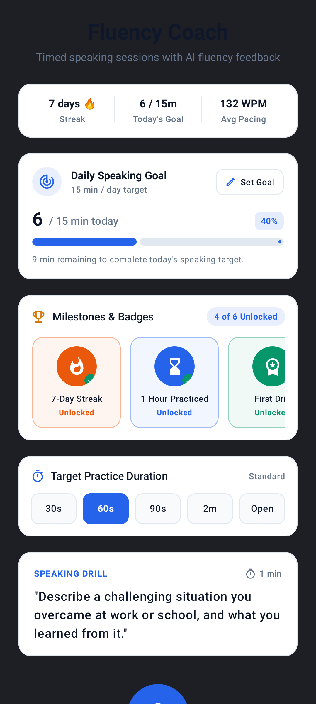
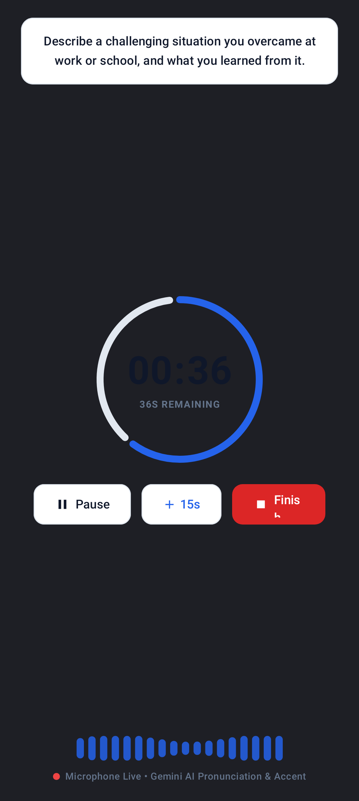
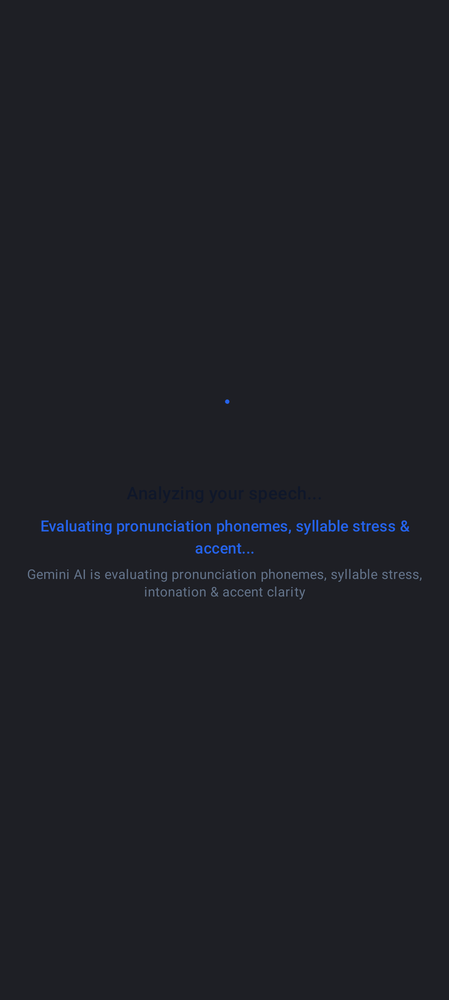
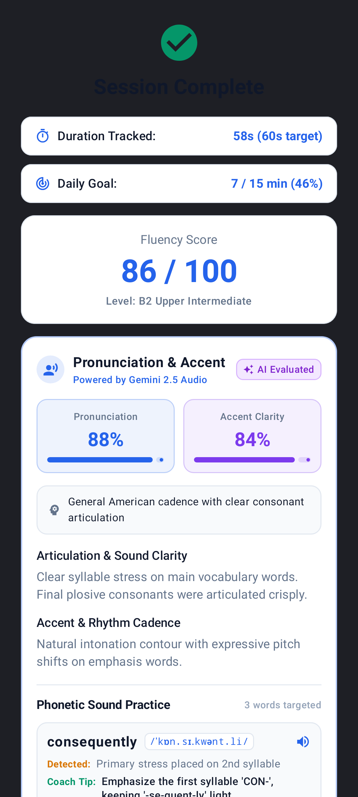
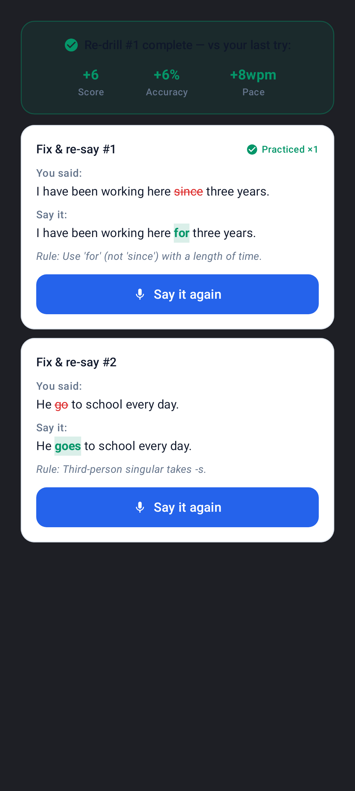

# Open Speech 🎙️

[](https://github.com/sunnydev07/Open-Speech/actions/workflows/pages.yml)
[](https://sunnydev07.github.io/Open-Speech/)
[-2563EB?logo=android&logoColor=white)](https://sunnydev07.github.io/Open-Speech/app-debug.apk)
[](app/build.gradle.kts)
[](LICENSE)

> **Open Speech** is an open-source AI English speaking coach Android app built with native **Jetpack Compose** and powered by **Google Gemini AI**. Grounded in peer-reviewed **Second Language Acquisition (SLA)** research, it moves beyond simple scoring to actively guide language learners toward authentic fluency.

🌐 **Try the Live Web Demo:** [https://sunnydev07.github.io/Open-Speech/](https://sunnydev07.github.io/Open-Speech/)  
📥 **Download APK:** [Direct Download (v1.1 • 23.4 MB)](https://sunnydev07.github.io/Open-Speech/app-debug.apk) | [GitHub Releases](https://github.com/sunnydev07/Open-Speech/releases)

---

## 📱 Screenshots (Native Pixel 8 Compose Renders)

| 🏠 Dashboard | 🎙️ Live Recording | ⚡ AI Analyzing | 🏆 Fluency Results | 🔁 "Fix & Re-Say" Drill |
|:---:|:---:|:---:|:---:|:---:|
|  |  |  |  |  |

---

## 🔬 Grounded in Second Language Acquisition (SLA) Science

Most language learning apps only provide a generic score. Open Speech closes the cognitive learning loop by implementing methods validated by modern SLA literature:

1. **Noticing Hypothesis (Schmidt 1990)**: Learners cannot correct phonetic deviations they do not perceive. With **in-app audio playback**, learners listen back to their own recording immediately after speaking with clickable timeline seeking and speed controls.
2. **Task Repetition with Delta Tracking (Zhang 2023)**: Immediate re-attempts on the same speaking prompt show marked gains in articulation rate, lexical access, and filler reduction. Open Speech tracks attempt-to-attempt progress with side-by-side metric comparisons (`Attempt 2 of 2: +6 pts, +14 WPM, -2 pauses`).
3. **Metacognitive Self-Assessment (Dörnyei 2005 & Oxford 1990)**: Before seeing AI scores, learners rate their own flow, clarity, and confidence. The app then calculates their **Calibration Gap**, reassuring anxious speakers who underestimate their ability and pinpointing blind spots.
4. **Target Acoustic Modeling (Foote & McDonough 2017)**: Hearing target acoustic models directly after an error is flagged accelerates phoneme accuracy. Each phonetic tip includes **dual-speed native TTS models** (`1.0x` natural cadence and `0.7x` slow articulation).
5. **"Say It Again" Form-Focused Re-Drills (Lyster & Saito 2010)**: Rather than overwhelming learners with ten generic suggestions, the app extracts exact sentence diffs and launches a focused **30-second micro-drill** on a single corrected sentence.

---

## ✨ Key Features

- **⏱️ Flexible Timed Speaking Sessions**: Choose presets of 30s, 60s, 120s, or Free-Flow with live countdown rings and waveform visualizers.
- **📚 Adaptive Prompt Library**: 20+ prompts categorized across CEFR levels (A2 to C1), covering interview scenarios, opinion framing, storytelling, and professional triage.
- **🤖 Gemini AI Evaluation**: Strict-JSON parsing evaluating:
  - Overall Fluency Score (0–100) & CEFR level mapping (A1–C2).
  - Speech Rate in Words Per Minute (WPM with 120–150 target thresholds).
  - Hesitation pauses (>1s) and filler word frequency (`um`, `uh`, `like`).
  - Grammar and syntax accuracy percentage.
- **🗣️ Pronunciation & Accent Profiling**:
  - Detected accent cadence (e.g., General American).
  - Phonetic tips complete with IPA spelling, syllable stress guidelines, and audio reference models.
- **🔁 Sentence Corrections & Re-Drill Loop**:
  - Highlights *Original Sentence* vs. *Corrected Sentence* with inline word-level diffs.
  - One-tap "Practice this fix" micro-session that links back to the parent session in the database.
- **🔒 Local-First Privacy & Persistence (Room DB v3)**:
  - All session records, streaks, and daily targets are stored on-device using SQLite/Room.
  - Zero login required; no personal identification, email, or third-party tracking.
- **📤 Share Fluency Report**: Native Android share sheet integration to celebrate practice milestones and streaks with peers or mentors.
- **📱 Responsive Web Companion**: Test the app directly in your desktop or mobile browser via our GitHub Pages simulator at [sunnydev07.github.io/Open-Speech](https://sunnydev07.github.io/Open-Speech/).

---

## 🏗️ Architecture & Tech Stack

```
Open-Speech/
├── app/src/main/java/com/example/
│   ├── MainActivity.kt                  # AppState machine, SpeechViewModel & Composable screens
│   ├── ai/
│   │   ├── GeminiPronunciationService.kt # Gemini 2.5 Flash REST client, prompt engineering & parsers
│   │   ├── PromptLibrary.kt             # CEFR-graded prompt rotation library
│   │   └── CefrMapper.kt                # Scientific rubric mapping fluency metrics to CEFR bands
│   ├── audio/
│   │   └── AudioRecorderManager.kt      # MediaRecorder (AAC/MPEG-4, 44.1kHz) & amplitude StateFlow
│   ├── data/
│   │   ├── SessionEntity.kt             # Room DB schema with parent-child drill hierarchy
│   │   └── AppDatabase.kt               # Room database instance (v3)
│   ├── ui/
│   │   ├── components/
│   │   │   ├── AudioPlaybackCard.kt     # In-app recording playback with slider seek
│   │   │   ├── ImprovementComparisonCard.kt # Side-by-side prompt repetition deltas
│   │   │   ├── SelfAssessmentComponent.kt # Metacognitive 3-star rating & calibration card
│   │   │   ├── RedrillCard.kt           # "Fix & re-say" sentence corrections & drill target banner
│   │   │   ├── PronunciationAccentCard.kt # Dual score meters & TTS phonetic models
│   │   │   ├── DailyGoalComponent.kt    # Daily target tracking & streak calculation
│   │   │   └── MilestoneBadgeComponent.kt # Gamified milestones & consistency badges
│   │   ├── effects/
│   │   │   └── EffectComponents.kt      # Canvas waveform audio visualizer & subtle clicks
│   │   └── theme/                       # Modern Material3 Dark/Light typography & palettes
│   └── util/
│       ├── TtsHelper.kt                 # Android TextToSpeech engine with dual-speed playback
│       ├── WordDiff.kt                  # Word-level diff highlighter for grammar corrections
│       ├── ShareProgressHelper.kt       # Native Android share sheet report generator
│       ├── StreakCalculator.kt          # Calendar-date streak computation
│       └── HapticFeedbackHelper.kt      # Tactile haptic feedback
├── preview/                             # GitHub Pages interactive site & prebuilt APK
└── .github/workflows/pages.yml          # Automated CI/CD Pages deployment
```

### Core Technologies
- **UI Framework:** [Jetpack Compose](https://developer.android.com/jetpack/compose) with Material 3
- **Language:** Kotlin (100%) + Coroutines + `StateFlow`
- **Database:** Android Room 2.6 with parent-child relational sessions
- **AI Processing:** Google Gemini 2.5 Flash API with strict JSON schema response mode
- **Audio Engine:** Android `MediaRecorder` + `MediaPlayer` + `TextToSpeech`
- **Testing:** JUnit 4 + Robolectric + Roborazzi Compose screenshot tests

---

## 🚀 Getting Started

### Prerequisites
- Android Studio Koala (2024.1.1) or newer
- JDK 17
- Android SDK 35 / 36 (Minimum SDK: 24 / Android 7.0+)

### Setup Instructions

1. **Clone the repository:**
   ```bash
   git clone https://github.com/sunnydev07/Open-Speech.git
   cd Open-Speech
   ```

2. **Configure Gemini API Key:**
   Copy `.env.example` to `.env` in the root folder:
   ```bash
   cp .env.example .env
   ```
   Add your Google Gemini API key:
   ```properties
   GEMINI_API_KEY=your_actual_gemini_api_key_here
   ```
   *(Note: If no API key is provided, the app runs in **Diagnostic Demo Mode** with realistic templated feedback).*

3. **Build and Run:**
   - Open the project in Android Studio.
   - Select an emulator or physical device.
   - Click **Run** or use the Gradle wrapper:
     ```bash
     ./gradlew assembleDebug
     ```

4. **Run Unit & Screenshot Tests:**
   ```bash
   ./gradlew testDebugUnitTest
   ```

---

## 📦 Install Prebuilt APK

You can install the app directly on your Android phone without building from source:

```bash
adb install preview/app-debug.apk
```

Or download it directly from your mobile browser:  
👉 **[Download Latest APK (v1.1)](https://sunnydev07.github.io/Open-Speech/app-debug.apk)**

---

## 🗺️ Fluency Roadmap

- [x] **In-App Audio Playback**: Listen back to your recorded voice on the results screen (Schmidt 1990).
- [x] **Task Repetition & Comparison**: Retry prompts with side-by-side metric deltas (Zhang 2023).
- [x] **Metacognitive Self-Assessment**: Pre-result confidence calibration (Dörnyei 2005).
- [x] **Target Phonetic Acoustic Modeling**: Normal & 0.7x slow native TTS drills (Foote 2017).
- [x] **Form-Focused Sentence Corrections**: "Fix & re-say" micro-drills with word diffs (Lyster 2010).
- [x] **Local-First SQLite/Room DB**: Persistent session logs, streaks, and progress.
- [ ] **Interactive Conversation Mode**: Two-way streaming turn-taking using Gemini Live audio.
- [ ] **IELTS / TOEFL Tracks**: Official band-descriptor rubrics for Part 1/2/3 tasks.
- [ ] **Listen-and-Repeat / Shadowing Mode**: Word-level pronunciation alignment.

---

## 🤝 Contributing

Contributions are always welcome! Whether it's reporting a bug, suggesting a new speaking exercise, or adding a new SLA feature:

1. Fork the repository.
2. Create a feature branch: `git checkout -b feature/amazing-feature`.
3. Commit your changes: `git commit -m "feat: add amazing feature"`.
4. Push to your branch: `git push origin feature/amazing-feature`.
5. Open a Pull Request.

---

## 📄 License

This project is open-source software licensed under the **[MIT License](LICENSE)**.

```
Copyright (c) 2026 Sunny Kumar Dev
```
